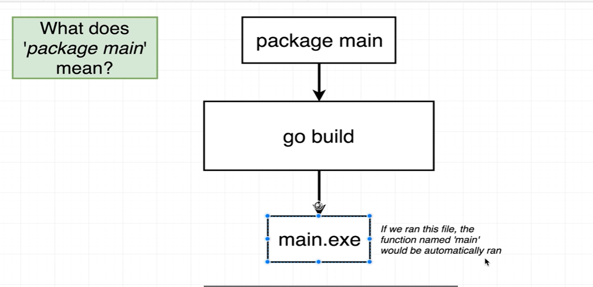
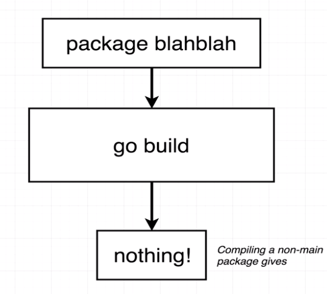
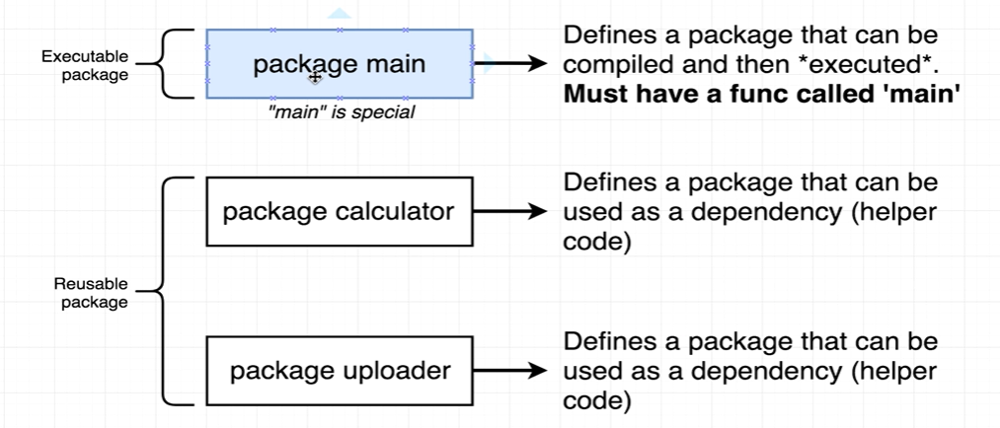
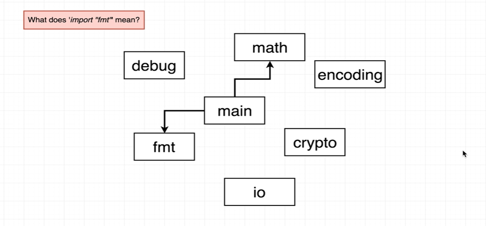
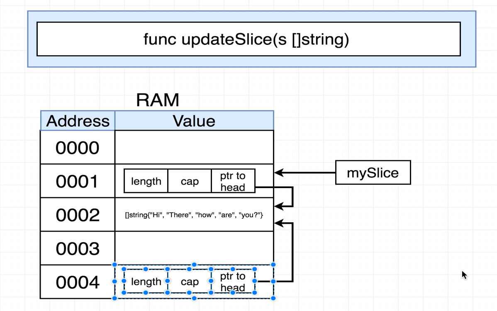
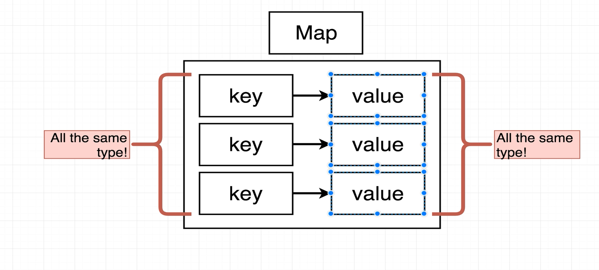
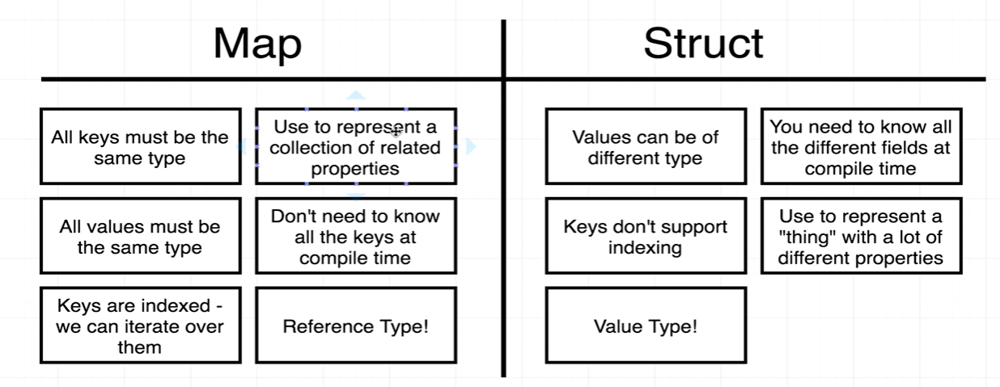

# Golang Self Learning Note
## 1. What does package main do? 


 - There are two types of packakages, which are: Executable and Reusable
 - When specify Package main in code, actually we wanna do a package that is used for executable not for sharing


 

 - In the above diagram, assume that we have package main and then we use the "go build" command it will generate for us a file which is main.exe and ofc we have to define our code inside the func main to run. So whenever we wanna make a runnable file just go for package main or else it will become like this:
 
 

 - For summarize, we can see the comparision as follow:

    

## 2. Impport statement
 - With package, we can specify a type of package that is reusable, therefore using import when writting code will give us a way to use those packages
  - For example: Import "fmt", and after that we can start using this fmt package like fmt.Println("Hello Linh hong chanh"), view the diagram below:




## 2. Referrecence as value type  
For example, we have a variable with the type of slice here, actually, when we create a slice, Go will automatically create an array and a structure that contains the length of the slice, the capacity and the referrence to the underlying array,  the moment when we pass this variable as a parameter in a function, 



## 3. Struct

## 4. Map
 - Map define structure: 

- Comparation betwwen ```Map``` and ```Struct```


## 5. Interface in Go
 We know that: Every value has a type and every function has to specify the type of its arguments => Every function we ever write has to rewritten to accomodiate different types even if the logic in it is identical?


